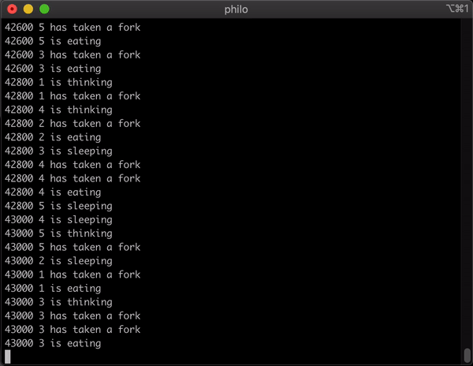

# philosophers - A Multithreading Synchronization Simulation

*This project was developed as part of the Ecole 42 curriculum.*

## Overview

`philosophers` is a project at Ecole 42 with emphasis on multithreading. It is a simulation that resolves [the dining philosopher's problem](https://en.wikipedia.org/wiki/Dining_philosophers_problem).



## Description

The `philosophers` program was my introduction to multithreading and mutexes. You have to make the individual processes run in a synchronous manner without them talking with each other.

- **Multithreading**: Running multiple threads concurrently to maximize CPU utilization.
- **Synchronization**: Coordinating threads' access to shared resources to prevent conflicts.
- **Algorithmic thinking**: Creating efficient strategies for resource access without deadlocks.
- **Mutexes**: Controlling shared resource access by allowing one thread at a time.
- **Deadlock Avoidance**: Preventing indefinite thread/resource wait situations.

## Installation

```bash
git clone https://github.com/tikanoja/Philosophers philo && cd philo && make
```

## Usage

./philo <number of philos> <time to die> <time to eat> <time to sleep> [number of times to eat]

```bash
./philo 5 800 200 200 10
```

## Helpful Resources

If you wish to make a similar project, I would highly suggest [this Medium article by user Ana](https://medium.com/swlh/the-dining-philosophers-problem-bbdb92e6b788).

Some test values for you to try out!
No one should die:
	5 600 150 140
	5 800 200 200
	105 800 200 200
	200 410 200 200

One should die:
	1 800 200 200
	2 310 200 100
	4 310 200 100